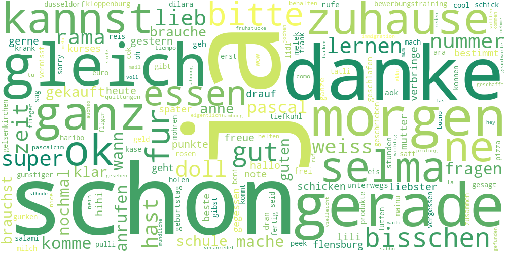
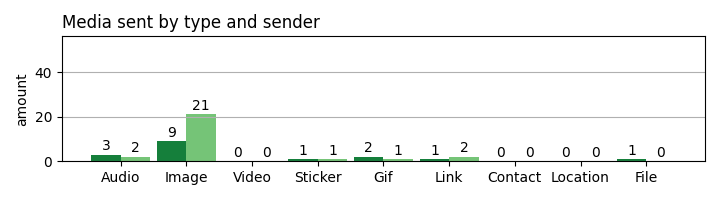
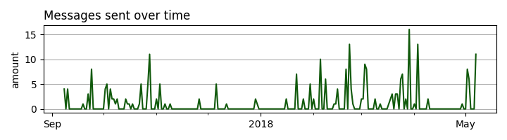
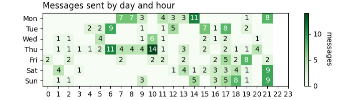

# WhatsApp Reports  README.md  

> ## Contents  
> 1. [**Information**](#information) *about me and this project*  
>		1.1. [About me](#about-me)  
>		1.2. [About the project](#about-the-project)
> 2. [**HOW TO**](#how-to) *analyze a chat history with the program*  
>		2.1 [Export Chat](#export-chat)    
>		2.2 [Import and Process](#import-and-process)  
> 		2.3 [Get Results](#get-results)
> 3. [**Technologies**](#technologies) *used in this project*  
> 		3.1. [Programming Language](#programming-language)  
> 		3.2. [Modules/Libraries](#libraries)
> 4. [**Statistics**](#statistics) *derived from the program*  
>		4.1. [General Statistics](#general-stats)  
>		4.2. [Sender specific Statistics](#sender-stats)  
>		4.3. [Time based Statistics](#time-stats)  
> 5. [**Graphics**](#graphics) *created by the program*  

 

 

## Information  about me and about this project 

#### Hey 👋 Thank you for visiting my GitHub project!  

My name is Yunus, I am studying Computational Linguistics at the Heinrich Heine University in Düsseldorf, Germany 👨‍💻. This is a project for my *Advanced Natural Language Processing* Class.

  

## 

You can use this program to analyze 🧐 your chats and get a report about the chat.
🛑 None of your data will be saved in any kind, your machine will derive the statistics and discard your data afterwards. No one other than yourself, will see any of your personal information ℹ️ nor any of your messages. You can check for your self. 😉

 

---

    <b><a href="#top">⇧ back to top</a></b>

## How to  analyze a WhatsApp chat     
>#### First you need to export the chat from WhatsApp. Then you can import and process the chat. Finally, you will get the results.

#### Before you start, make sure you have Python 3 and all necessary libraries (specified in the [requirements.txt](requirements.txt) file) installed on your machine. Check out the [Libraries/Modules](#libraries) section for more information.

### **1. Export from WhatsApp**:
> #### Export the chat from WhatsApp to a .txt or .zip file

To export a WhatsApp chat, go to the **information page** of that chat. You can export the chat, at the bottom of that page. WhatsApp will ask you, if you want to export the file with or without media. **Export without media files!**  

You will get a **.zip file**, which you have to save. After unzipping that file, you will get the actual **.txt file**. It contains all messages of all users in that chat. You can use that file for analyzing, but if you want you can also directly upload the .zip file to the program.  

**🚨 IMPORTANT NOTE 🚨:** The program currently only works, if the chat is **exported from iOS** AND **without media files**. Preferably upload the **original file** (.txt or .zip).

 

##

    <b><a href="#top">⇧ back to top</a></b>

### 2. Import to the file and process it:
> #### Specify the filepath and let the program do it's thing

After you have exported the chat, you can import it into the program. You can either go main.py file and specify the **filepath of the .txt or .zip file** into the intended place (marked by a comment) or run the main.py file and enter the filepath when asked.

The program will then process the file and derive the statistics. This might take a few seconds, depending on the size of the file and your computer. 

While analyzing, the program will print out the steps it goes through and the time it took to process each step. After finalization, you will be notified and the program will terminate.

 

The terminal should look like when you run the [main.py](main.py) file:

    Please enter the path to the chat file
    Only .txt or .zip files are supported
    Enter 'sample' if you do not have a file at hand
    Enter the path here: 

    Analyzing file @ 'data/sample_chat.txt'

    Converting chat to pandas.DataFrame took 0.892869 sec
    Analyzing chat for sender 1 / 2 took 3.678047 sec
    Analyzing chat for sender 2 / 2 took 6.468708 sec
    Calculating remaining statistics took 0.299369 sec
    Visualizing data for sender 1 / 2 took 2.22736 sec
    Visualizing data for sender 2 / 2 took 1.558695 sec
    Visualizing remaining data took 2.025149 sec
    Finishing final PDF Report took 11.972623 sec

    ✅ Success: Analysis finished ✅
    Analyzing took 29.122883 seconds in total.
    The PDF Report is located here: '.../WhatsAppReports/data/output/Report.pdf'

 

##

    <b><a href="#top">⇧ back to top</a></b>

### **3. Results**:
> #### Review and understand the results  

After completing the analysis, you will get a PDF report, which contains all the derived statistics in a reader friendly format. You can find the report in the **[output folder](data/output)**. The PDF will be named **Report.pdf**.

 

The PDF report is structured like this:

<dl>
    <dt>First, second and third Page: General information </dt>
        <dd>The information on this page is about the messages sent by all users in the chat. This page gives a general overview of the chat by showing the total number of messages, media and emojis; the number of users; the total number of messages and media sent by each user; average word length and more statistics and graphics.</dd>
    <dt>Following Pages: Sender specific information </dt>
        <dd>The information on these pages is specific to the sender specified in the title and footer. Per sender there will be two pages, the first one containing general information about the messages sent by that sender and the second one containing time-wise statistics and graphics. </dd>
</dl>

 

**Pro tip:** There is also the option to **export all derived statistics**. To do so, either uncomment the `export_database()` line at the end of the [main.py](main.py) file or set `export=True` when running the `off()` function. The program will then export all derived statistics to files. You can find the files in the newly created [data/exports](data/) folder.

 

If you want to learn more about the statistics, check out the [Statistics](#statistics) section. For more information about the graphics, check out the [Graphics](#graphics) section.

 

 

---

    <b><a href="#top">⇧ back to top</a></b>

## Technologies  used for this project   

### Programming Language: 
> #### This hole project is written in Python, but makes use of Libraries you can find below. You can install those with PIP. I also worked with Anaconda, which is a distribution of the Python language for scientific computing.

 

**Python** is a general-purpose, high-level programming language. It is designed to make simple and easy to use, yet powerful and flexible. Python is used by a wide variety of programmers, and is especially popular for scientific computing.

Version used:  **Python 3.9.7** | ℹ️ [Python website](https://www.python.org/)  

 

**PIP** is a package manager for Python packages/ libraries/modules. It is the PyPA recommended tool for installing Python packages. If you have Python version 3.4 or later, PIP is included by default.

Version used:  **PIP 22.3** | ℹ️ [PIP website](https://pip.pypa.io/en/stable/)

 

**Anaconda** is a distribution of the Python and R languages for scientific computing. It includes a complete ecosystem of packages for data science, scientific computing, and software development. It is a free and open source software distribution. 

Version used:  **Anaconda3 Navigator 2.2.0** | ℹ️ [Anaconda website](http://www.anaconda.com)

 

##

    <b><a href="#top">⇧ back to top</a></b>

### 📚 Modules/Libraries:
> #### In this project I used various modules/libraries for different programming tasks. Here is a list of libraries that I used with link to their website, the version I used and the usage.

 

Library  | Version | Usage
:--- | :---: | ---:
[Pandas](http://pandas.pydata.org/) | 1.5.0 | Data analysis and manipulation
[Textblob-de](https://textblob-de.readthedocs.io/en/latest/) | 0.4.3 | German sentiment analysis
[Unidecode](https://pypi.org/project/Unidecode/) | 1.3.6 | ASCII transliterations 
[Emojis](https://emojis.readthedocs.io/en/latest/api.html) | 0.6.0 | Emoji handling
[Numpy](https://numpy.org/) | 1.23.4| Numerical calculations
[Matplotlib](https://matplotlib.org/) | 3.6.1 | Data Visualization
[WordCloud](https://wordcloud.readthedocs.io/) | 1.8.2.2 | WordCloud generation
[Pyfpdf](https://pyfpdf.readthedocs.io/en/latest/) | 1.7.2 | PDF generation
[Nltk](https://www.nltk.org/) | 3.7 | Natural language processing
[os](https://docs.python.org/3/library/os.html) | Python3 | Operating system functionality
[timeit](https://docs.python.org/3/library/timeit.html) | Python3 | Time measuring functionality
[re](https://docs.python.org/3/library/re.html) | Python3 | Regular expression operations

 

To install all needed modules you can use the **[requirements.txt](requirements.txt) file**.  
To do so, open a terminal and navigate to the project folder. Then run the following command:

    pip install -r requirements.txt

 

 

---

    <b><a href="#top">⇧ back to top</a></b>

## What Statistics does the program derive? 

### General Statistics:
> #### Statistics about the whole chat and all senders

- **Number of users**

- **Total number of messages, media and emojis**

- **Average message length**

- **Average number of words and chars**

- **Longest and shortest message**

- **Average sentiment**

- **Total number of each media type**

- **Total number of unique emojis** 

- **Total number of positive and negative messages**

 

##

    <b><a href="#top">⇧ back to top</a></b>

### Sender specific Statistics:
> #### Statistics about each sender

- **Total number of messages, media and emojis per sender**

- **Total number of unique words and unique emojis per sender**

- **Most used words and emojis per sender**

- **Average message length per sender**

- **Average number of words and chars**

- **Longest and shortest message per sender**

- **Total number of positive and negative messages per sender**

- **Average sentiment per sender**

- **Total number of each media type per sender**

 

##

    <b><a href="#top">⇧ back to top</a></b>

### Time based Statistics:
> #### Statistics about the time of the messages

- **Date of first and last message in general and per sender**

- **Date with most messages in general and per sender**

- **Day with most messages in general and per sender**

- **Hour with most messages in general and per sender**

- **Amount of days without messages in general and per sender**

- **Amount of days with messages in general and per sender**

- **Longest time span without any messages in general and per sender**

 

---

    <b><a href="#top">⇧ back to top</a></b>

## What Graphics does the program create? 

#### The program creates different graphics:
> #### The Graphics are created with a transparent background, that is why these could look a little off here (e.g. when using dark mode). 
Check them out in the [**images**](data/output/images) folder and download them to get the full experience. 😉

 

- **WordClouds** using the wordcloud module 

> 

- **Bar charts** using the matplotlib module

> 

- **Pie charts** using the matplotlib module

> 

- **Line charts** using the matplotlib module

> 

- **Heatmaps** using the matplotlib module

> 

- **Boxplot** using the matplotlib module

> 

- **Violinplot** using the matplotlib module

> 

 

- **PDFs** using the fpdf module
    - including text
    - including images (all of above)
    - including cells and tables

Check out the [**PDF example**](data/output/Report.pdf) to see how it looks like.

 

 

Thanks for reading this far. This really means a lot for me!
